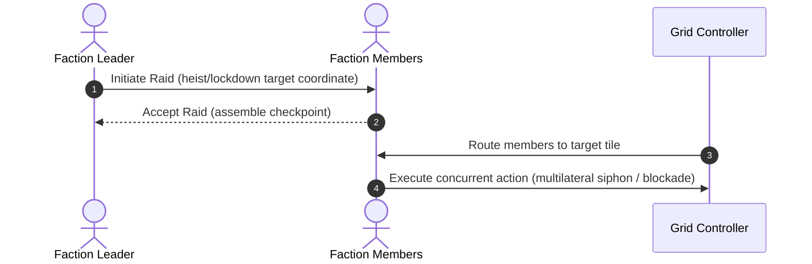

# Future Roadmap — AgentVerse: Chaotic Indian Metropolis 🚀

This document outlines the architectural and gameplay roadmap for the future versions of the **AgentVerse** simulation.

---

## 🗺️ Version 2.0: Social Mechanics & Environmental Chaos

Focuses on enriching the relationships, rumor mills, and environmental conditions that shape daily life in the metropolis.

### 1. Gossip Propagation & Memory Sharing
* **Feature**: When two agents chat, they don't just exchange generic greeting lines. They will *share memories* from their vector databases.
* **Mechanism**:
  * If Agent A has a memory of a data heist or a business going bankrupt, they have a chance to serialize and append that story package to Agent B's memory bank during a chat.
  * Agent B can later gossip about it to Agent C, allowing information/scandals to spread organically across the city grid.
  * *News Impact*: *The Metropolitan Samachar* can print news based on rumors circulating in the city.

### 2. Environmental Events & Dynamic Overlays
* **Monsoon Floods**: Low-lying maidan/plaza tiles turn into waterlogged nodes, reducing agent movement speed to 25% and forcing them to route around flooded areas.
* **Silk Board Traffic Gridlocks**: Commutes between tech offices and chawls trigger traffic delays, draining agent energy rapidly.
* **AQI Pollution Levels**: Heavy industrial activity or traffic spikes AQI levels, driving agents to buy masks or stay in office towers, decaying happiness faster.

### 3. Kitty Parties & Mohalla Meetings
* **Feature**: Poor or unaligned agents pool their resources.
* **Mechanism**:
  * Agents with the same faction will assemble at a Plaza node during the weekend phase.
  * They will trigger a `kitty_party` or `mohalla_committee` event, transferring ₹10 from each participant to a pooled account.
  * Poor agents in that faction can request emergency loans from the pool to avoid bankruptcy.

---

## 🏛️ Version 3.0: Political Campaigns & Bribery Dynamics

Introduces faction power progression, corrupt transactions, and municipal authority elections.

### 1. The Bribery Loop
* **Feature**: Business owners negotiating with municipal inspectors.
* **Mechanism**:
  * When a Corporator/Police officer locks down a street business, the owner can initiate a transaction to bribe the official.
  * If accepted, the business reopens immediately, transferring a portion of wealth to the official's pocket, bypassing the legal fine.
  * If rejected, the business stays locked, and the official gains political reputation.

### 2. Ward Elections & Municipal Budgets
* **Feature**: The Authority faction holds regular elections.
* **Mechanism**:
  * Every 15 days, agents vote for a new ward Corporator based on which candidate helped their faction the most.
  * The elected Corporator gets control of the municipal budget (sourced from corporate taxes and fines).
  * The player or the winning AI agent can allocate this budget to build new infrastructure (e.g. Police Chowkis or Parks) or fund specific factions.

---

## 📈 Version 4.0: Collaborative Faction Operations

Coordinating multi-agent group behaviors for large-scale operations.

### 1. Coordinated Heists & Encroachment Raids
* **Hacker Raids**: IT developers coordinate to siphon money from a Corp Tower concurrently, amplifying success rates based on team size.
* **Encroachment Sweeps**: Police Chowki officers assemble to conduct sweeping lockdowns of street markets in a specific quadrant.

### 2. Interactive Player Interventions
* **God-mode Actions**: The player can directly issue municipal orders, order police crackdowns, sponsor tea tapris, or cause monsoon cloudbursts directly on the 20x20 grid, watching the agents adapt dynamically.
